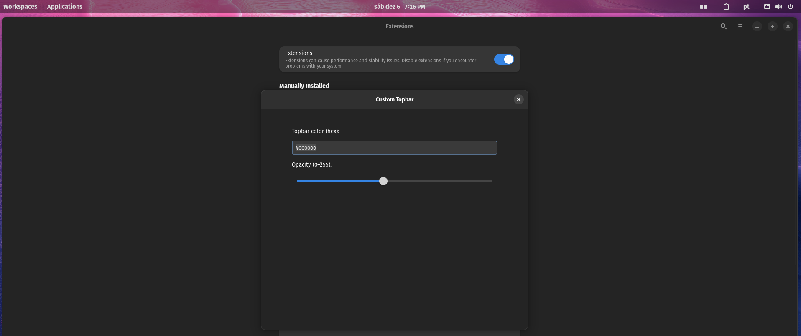
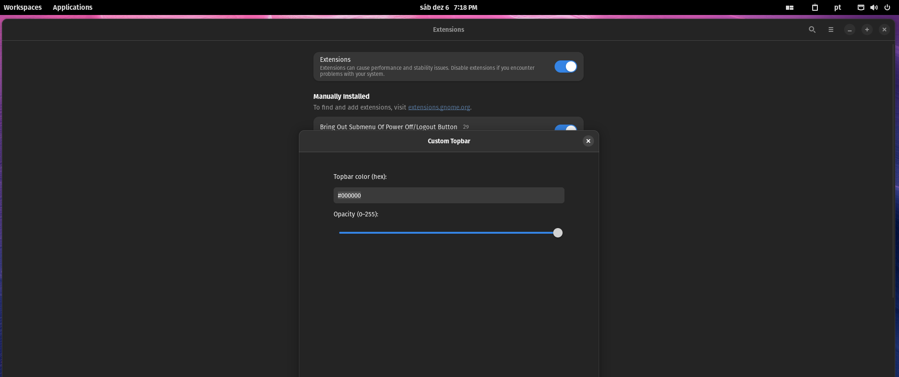
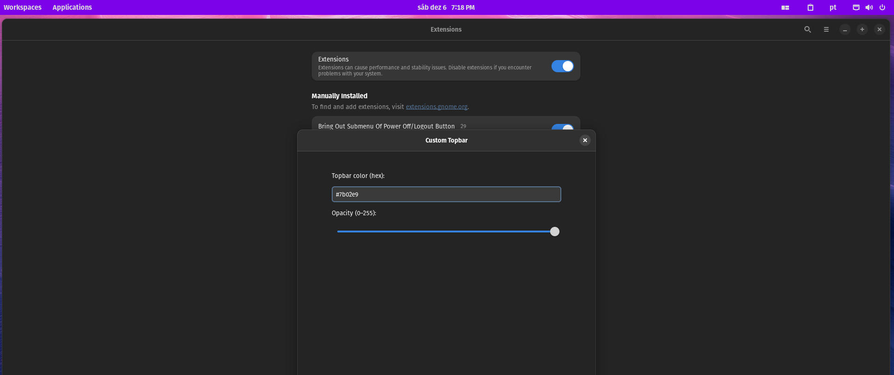
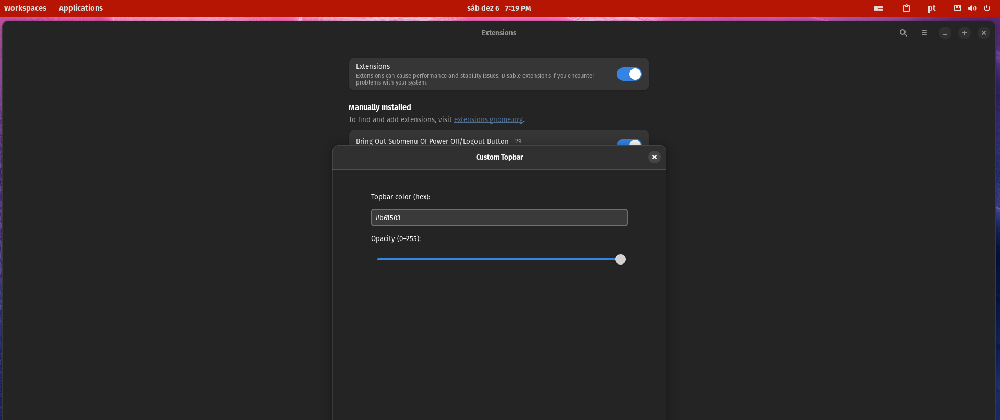

# Custom Topbar

Custom Topbar is a small GNOME Shell extension that lets you set a custom background color and opacity for the top panel (topbar).

## License

This project is licensed under the **Creative Commons Attribution-NonCommercial 4.0 International (CC BY-NC 4.0)** license.

You are free to use, modify, and share this extension for **non-commercial purposes**, as long as proper attribution is given.

See the full license in the [LICENSE](./LICENSE) file.

---

## Features

- **Custom color:** Set the topbar background using a hex color string (e.g. `#RRGGBB`).
- **Custom opacity:** Set topbar opacity on a 0–255 scale (0 = fully transparent, 255 = fully opaque).
- **Live reload:** Changes in the extension preferences are applied immediately.

---

## Requirements

- GNOME Shell (supported versions listed in `metadata.json`; this extension contains entries for 42–46). See `metadata.json` for exact supported versions.
- GLib / GSettings available in your environment (standard on GNOME desktops).
- `glib-compile-schemas` (used to compile the GSettings schema after install).

---

## Installation (local)

1. Copy (or clone) the extension directory into your local extensions folder:

```bash
cp -r /path/to/customtopbar@ihagofs.gmail.com \
    ~/.local/share/gnome-shell/extensions/customtopbar@ihagofs.gmail.com
```

2. Compile the GSettings schema used by the extension:

```bash
glib-compile-schemas ~/.local/share/gnome-shell/extensions/customtopbar@ihagofs.gmail.com/schemas/
```

3. Enable the extension:

```bash
gnome-extensions enable customtopbar@ihagofs.gmail.com
```

4. Reload GNOME Shell (Xorg) or restart session (Wayland):

- Quick reload (Xorg): press `Alt` + `F2`, type `r` and press Enter.
- Alternatively, log out and back in, or restart your session.

Notes:

- If you install system-wide, place the extension folder inside `/usr/share/gnome-shell/extensions/` and run the `glib-compile-schemas` command as root for the corresponding schemas directory.

---

## Usage

- Open the GNOME Extensions application (or use the website) and open the preferences for `Custom Topbar`.
- Or run the preferences command:

```bash
gnome-extensions prefs customtopbar@ihagofs.gmail.com
```

- In the preferences UI you can:
  - Set the **Topbar color** as a hex string (e.g. `#000000`).
  - Set **Opacity** using the slider (0–255).

Settings keys (GSettings schema `org.gnome.shell.extensions.customtopbar`):

- `topbar-color` (type `s`) — default: `"#000000"`
- `topbar-opacity` (type `i`) — default: `255`

The extension reads these values and applies an inline CSS `background-color: rgba(...)` style to the main GNOME top bar.

---

## Development

Project layout (important files):

- `extension.js` — main extension code (init, enable, disable, style application).
- `prefs.js` — preferences UI (GTK-based) that writes into the GSettings schema.
- `schemas/org.gnome.shell.extensions.customtopbar.gschema.xml` — GSettings schema describing configuration keys and defaults.
- `commands.txt` — helper commands (compile schemas, enable extension, reload GNOME Shell).

Key implementation notes:

- `extension.js` loads the schema at runtime from the extension's `schemas/` directory (this is necessary for GNOME 42+ when running from a local extension dir).
- Color is converted from hex `#RRGGBB` to `rgba(r,g,b,a)` using the integer opacity (0–255).
- The original panel style is stored on enable and restored on disable.

Debugging and testing tips:

- Tail GNOME Shell logs to see JS exceptions and messages:

```bash
journalctl /usr/bin/gnome-shell -f
```

- Use `gnome-extensions disable ...` and `gnome-extensions enable ...` to reload the extension while iterating.
- Use Looking Glass for live JS debugging: press `Alt+F2`, type `lg` and Enter.

---

## Contributing

- Please open issues or pull requests against this repository.
- Keep changes scoped and document any new settings or behavior.
- Add tests where applicable and ensure the GSettings schema remains correct.

Suggested workflow for changes:

1. Make changes in a branch.
2. Update or add schema keys in `schemas/*.gschema.xml` if needed.
3. Run `glib-compile-schemas` against the local `schemas/` directory to validate (for testing, run locally before creating a PR).

---

## Troubleshooting

- If preferences do not appear or values are not used, ensure `glib-compile-schemas` ran successfully for the extension `schemas/` directory.
- If the panel style does not update, check GNOME Shell logs for JS exceptions.

## 📸 Screenshots

### Custom Topbar Applied



